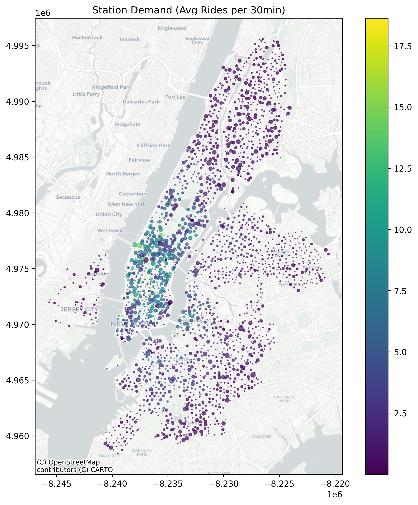
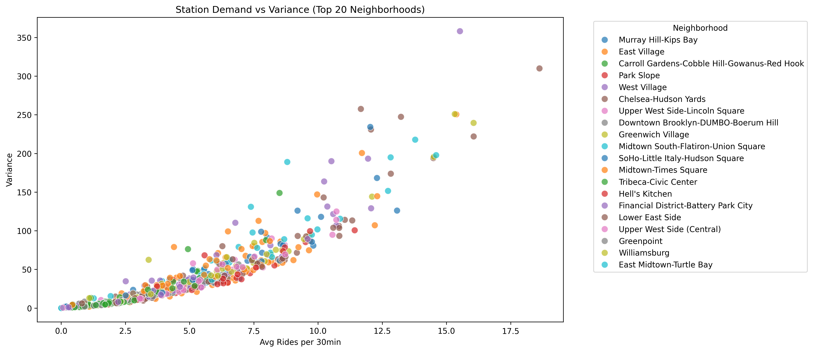
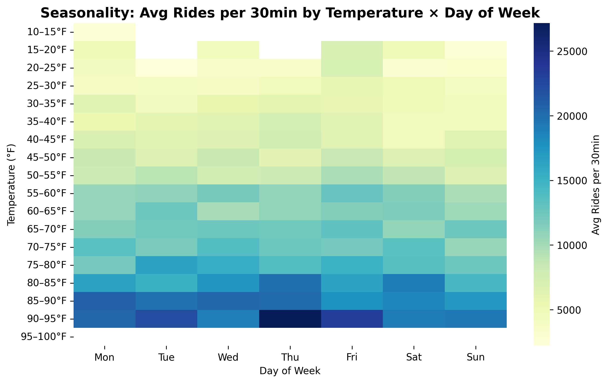
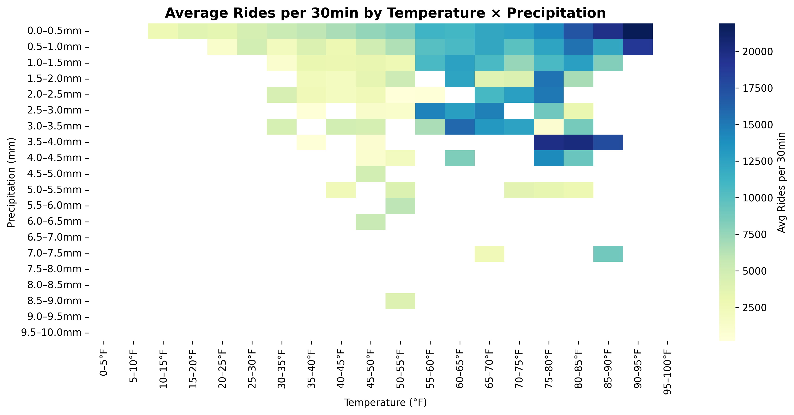
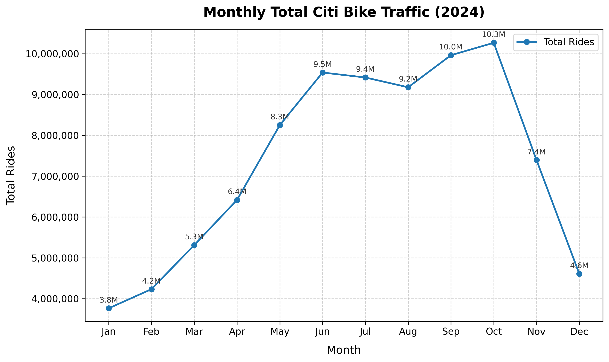
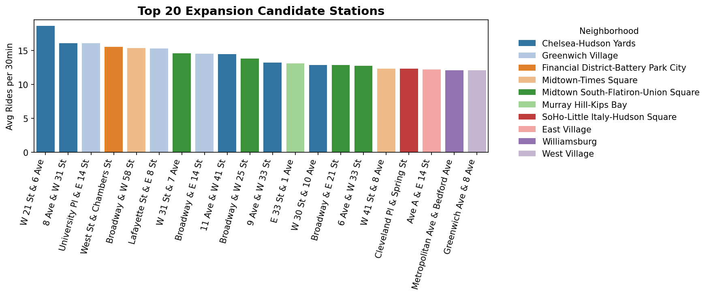
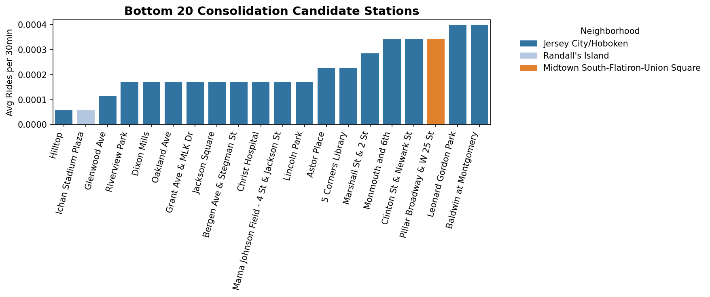

# Citi Bike Traffic Analysis (2024)

## Project Overview
This project analyzes NYC Citi Bike ridership across 2024 to understand how Citi Bike traffic is influenced by various factors. 
The goal is to identify clear usage patterns and highlight operational implications for system management.

---

## Methodology

### Data sources
- Citi Bike trip data (January–July 2024)  
- NOAA hourly and daily weather data for NYC  
- NYC Neighborhood Tabulation Areas (NTA) shapefile  

### Data cleaning
- Removed trips with missing or implausible times/durations 
- Ensured that each ride in the data was only accounted for a single time
- Converted timestamps to **America/New_York** and extracted features (hour, day-of-week, month)  
- Incorporated weather data with ridership using nearest hourly timestamps
- Created holiday and weekend indicator variables

### Spatial preparation
- Converted Citi Bike stations to a GeoDataFrame  
- Spatially joined stations to NTAs using polygon containment (`geopandas.sjoin`)  
- Aggregated demand to both station level and NTA level, enabling neighborhood-scale analysis  

### Analysis pipeline
1. Aggregate rides to 30-minute and daily levels  
2. Merge in weather and holiday features  
3. Aggregate to NTA-level demand time series for stability  
4. Generate exploratory analyses:  
   - Maps of mean and variance of demand by neighborhood  
   - Heatmaps of ridership vs temperature/precipitation  
   - Monthly curves to capture seasonal cycles  
   - Interactive demand maps  
5. Identify geographic hot spots, high-variance neighborhoods, and weather-driven demand dips

## Key Insights & Visuals

### 1. Station Demand Map
  
Hotspots are concentrated in **Midtown and Downtown Manhattan** as well as parts of **Brooklyn**.  
Outer borough stations show lower but more consistent usage.

---

### 2. Neighborhood Variability
  
Stations in the top 20 neighborhoods form distinct clusters:  
- Midtown/Downtown: **high demand, high variance** (commuter and tourist flows).  
- Outer boroughs: **lower demand, lower variance** (consistent neighborhood trips).  
This highlights how station type drives both volume and volatility.

---

### 3. Weather Effects
- **Temperature**: Ridership peaks in the **80–90°F range**, boosted by summer tourism and longer daylight.  
- **Precipitation**: Even light rain sharply reduces rides, with heavy rain cutting usage to near zero.  

   

Weather is a strong, immediate driver of demand — making it essential for operational forecasting.

  

This heatmap shows average rides per 30min by **temperature (°F)** and **precipitation (mm)**.  
Key patterns:  
- Ridership holds up in cool, dry weather.  
- Even light rain causes sharp declines.  
- Heavy rain almost eliminates demand, regardless of temperature.  

Rain is a **bigger suppressor of demand than cold** — critical for forecasting and operations.
---

### 4. Seasonality
  
Monthly totals follow a clear curve:  
- **Winter lows** (January–February).  
- **Spring climb** (March–May).  
- **Summer peak** (July–August).  
- **Fall tapering** (September–November).  

This mirrors recreational cycling patterns and highlights capacity stress during summer.

---

## Recommendations

Based on the analysis, Citi Bike could implement:

- **Dynamic rebalancing** → Concentrate bike movement in Midtown and Brooklyn hubs during peak hours.  
    
  *High-demand clusters highlight where rebalancing trucks deliver the most impact — targeting these areas reduces stockouts and idle docks.*

- **Seasonal planning** → Expand fleet size and staffing in the summer months to absorb surges.  
    
  *Summer peaks show the system strains under higher demand; scaling up capacity seasonally ensures smoother rider experience.*

- **Weather-aware strategy** → Integrate rain forecasts into redistribution and staffing decisions.  
    
  *Even light rain suppresses demand more than cold — short-term ops adjustments should focus on rainy windows, not just temperature swings.*

- **Expansion opportunities** → Invest in outer-borough neighborhoods with consistent, moderate demand.  
    
  *Low-variance, steadily used stations suggest reliable everyday trips; expanding here steadily grows the user base without volatility.*

- **Consolidation opportunities** → Reevaluate underused or volatile stations that strain resources.  
    
  *Stations with persistently low ridership or extreme variability may warrant consolidation, relocation, or redesign to improve efficiency.*

 

---

## Tools & Data
- **Python**: pandas, matplotlib, seaborn, geopandas, plotly  
- **Data**: NYC Citi Bike system data (2024 trips & stations), NOAA weather data  
- **Notebooks**: [`Final Notebook.ipynb`](Final%20Notebook.ipynb)  

---

## Repository Contents
- `Final Notebook.ipynb` → main analysis notebook  
- `Final Notebook.html` → rendered HTML report  
- `README.md` → this file  
- `figures/` → saved PNGs of key visuals  

---

## How to Run
1. Clone the repo  
2. Install requirements:  
   ```bash
   pip install -r requirements.txt
