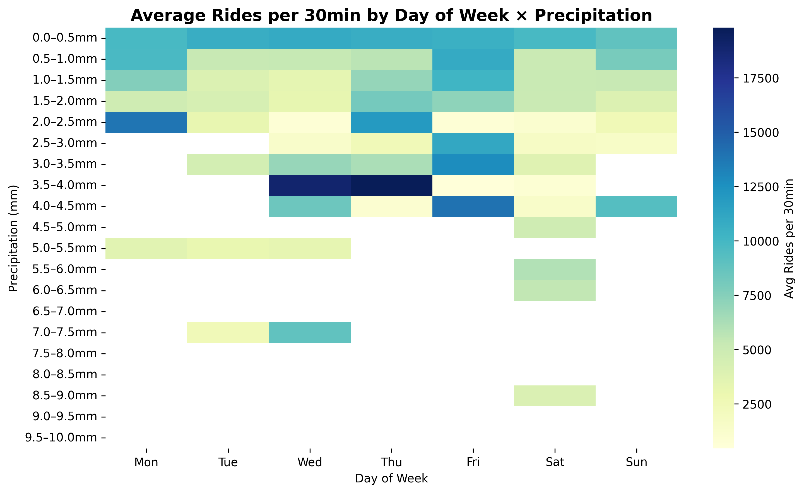

# Citi Bike Demand Analysis (2024)

## Project Overview
This project analyzes NYC Citi Bike ridership across 2024 to understand how **geography, weather, and events** influence demand.  
The goal is to identify clear usage patterns and highlight operational implications for bike-share management.

---

## Key Insights & Visuals

### 1. Station Demand Map
  
Hotspots are concentrated in **Midtown and Downtown Manhattan** as well as parts of **Brooklyn**.  
Outer borough stations show lower but steadier usage, suggesting a split between **commuter-heavy cores** and **residential stability**.

---

### 2. Neighborhood Variability
  
Stations in the top 20 neighborhoods form distinct clusters:  
- Midtown/Downtown: **high demand, high variance** (commuter and tourist flows).  
- Outer boroughs: **lower demand, lower variance** (consistent neighborhood trips).  
This highlights how station type drives both volume and volatility.

---

### 3. Weather Effects
- **Temperature**: Ridership peaks in the **80–90°F range**, boosted by summer tourism and longer daylight.  
- **Precipitation**: Even light rain sharply reduces rides, with heavy rain cutting usage to near zero.  

   

Weather is a strong, immediate driver of demand — making it essential for operational forecasting.

  

This heatmap shows average rides per 30min by **temperature (°F)** and **precipitation (mm)**.  
Key patterns:  
- Ridership holds up in cool, dry weather.  
- Even light rain causes sharp declines.  
- Heavy rain almost eliminates demand, regardless of temperature.  

👉 Rain is a **bigger suppressor of demand than cold** — critical for forecasting and operations.
---

### 4. Seasonality
  
Monthly totals follow a clear curve:  
- **Winter lows** (January–February).  
- **Spring climb** (March–May).  
- **Summer peak** (July–August).  
- **Fall tapering** (September–November).  

This mirrors recreational cycling patterns and highlights capacity stress during summer.

---

## Recommendations

Based on the analysis, Citi Bike could:

- **Dynamic rebalancing** → Prioritize bike movement into Midtown and Brooklyn hubs during peaks.  
  *High-demand clusters in Midtown and Brooklyn suggest rebalancing resources here during rush hours.*

- **Seasonal planning** → Expand summer fleet and operations to handle surges.  
  *Monthly traffic trends show clear spikes in warmer months, highlighting the need for seasonal scaling.*

- **Weather-aware strategy** → Adjust staffing and redistribution based on rain forecasts.  
    
  *Rides drop sharply on rainy days, suggesting weather-sensitive operations would improve efficiency.*

- **Expansion targeting** → Invest in outer borough neighborhoods with steady growth potential.  
    
  *Certain outer borough stations show consistent, rising demand, supporting targeted expansion.*
 

---

## Tools & Data
- **Python**: pandas, matplotlib, seaborn, geopandas, plotly  
- **Data**: NYC Citi Bike system data (2024 trips & stations), NOAA weather data  
- **Notebooks**: [`Final Notebook.ipynb`](Final%20Notebook.ipynb)  

---

## Repository Contents
- `Final Notebook.ipynb` → main analysis notebook  
- `Final Notebook.html` → rendered HTML report  
- `README.md` → this file  
- `figures/` → saved PNGs of key visuals  

---

## How to Run
1. Clone the repo  
2. Install requirements:  
   ```bash
   pip install -r requirements.txt
